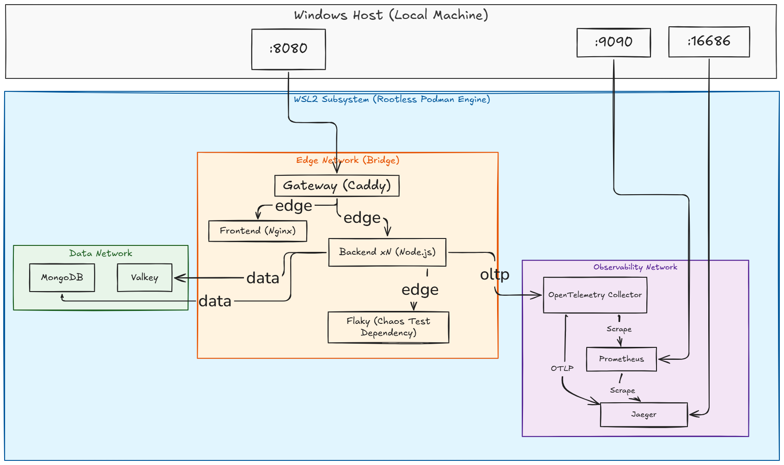

# Cloud-Native Architecture & Systems Engineering: Practicum Manual

**Course Code:** CNSD2026

**Target Audience:** Junior Software Engineers & Cloud Practitioners

**Environment:** Windows 10/11 with WSL2, Podman Desktop (Fully Rootless)

**Estimated Completion Time:** 5 Hours (Five 50–60 minute structured labs)

**Solution Repository:** `[https://github.com/suriarasai/CNSD2026/tree/main/cloud-native-app](https://github.com/suriarasai/CNSD2026/tree/main/cloud-native-app)`

---

## Lab Learning Outcomes Progression

This lab  uses an **additive, stacked architecture**. Each lab builds directly upon the operational artifacts and source code of the preceding lab session. By completing all five labs, you will evolve a basic local application into a multi-replica, fault-tolerant, fully observable distributed system running within a rootless local environment.

```
+-------------------------------------------------------------------------------+
|  1. Orchestration  | Rootless execution, multi-container topologies, ingress  |
|  2. State Mgmt     | Stateless compute, externalized sessions, volumes        |
|  3. Resilience     | Timeouts, exponential backoff/jitter, circuit breakers   |
|  4. Elasticity     | Horizontal scaling, dynamic discovery, load balancing    |
|  5. Observability  | OpenTelemetry standard, distributed tracing, metrics     |
+-------------------------------------------------------------------------------+

```

### Lab Instructional Pattern

Every lab follows a  systems-engineering cycle:

1. **Target Competency & Industry Context:** The operational standard and rationale.
2. **Implementation:** Declarative infrastructure and application configuration.
3. **Verification Checkpoint:** Deterministic operational tests.
4. **Fault Injection ("Break It"):** Inducing systematic failures to validate architectural boundaries.


The solution files are in the project f
`CNSD2026/cloud-native-app/`. They are the *finished* artefacts for
every lab; the lab manual (`LAB-MANUAL.md`) walks through producing
them step by step.

```
cloud-native-app/
├── LAB-MANUAL.md               <- the lab, start here
│
├── compose.yaml                <- FINAL: Labs 1+2+3+4+5 stacked
├── compose.lab1.yaml           <- checkpoint: orchestration only
├── compose.lab2.yaml           <- checkpoint: + Valkey, volumes, read-only rootfs
├── compose.lab3.yaml           <- checkpoint: + chaos dep, health gates, drain
├── compose.lab4.yaml           <- checkpoint: + per-replica resource bounds
│
├── gateway/
│   ├── Caddyfile               <- FINAL: dynamic upstreams + round robin + metrics
│   └── Caddyfile.lab1          <- simple static upstream, for Lab 1
│
├── backend/
│   ├── Containerfile           <- multi-stage, non-root
│   ├── package.json            <- with valkey/opossum/otel deps added
│   ├── server.js               <- FINAL (sessions, cache, health, drain)
│   ├── resilience.js           <- timeout + retry + breaker + fallback
│   ├── logger.js               <- Winston with trace_id/span_id injection
│   └── .dockerignore
│
├── frontend/
│   ├── Containerfile           <- multi-stage -> nginx, copies nginx.conf
│   ├── nginx.conf              <- SPA fallback + /healthz, no API knowledge
│   └── api-url.patch.md        <- the one-line App.jsx change for Lab 1
│
├── flaky-service/              <- the chaos-injectable dependency (Lab 3)
│   ├── Containerfile
│   ├── package.json
│   └── server.js
│
├── otel/
│   ├── otel-collector-config.yaml
│   └── prometheus.yml
│
├── loadtest/
│   ├── k6-script.js            <- ramping profile for Lab 4
│   └── k6-soak.js              <- constant pressure for Lab 3 chaos
│
└── k8s/                        <- Lab 4 Appendix A (Kind + HPA + KEDA)
    ├── 00-namespace.yaml
    ├── 10-valkey.yaml
    ├── 20-backend.yaml
    ├── 30-hpa.yaml
    ├── 40-keda-scaledobject.yaml       (Valkey queue-depth trigger)
    └── 41-keda-prometheus-scaler.yaml  (request-rate trigger, closes the loop with Lab 5)
```

## Quick start ( smoke test)

```powershell
cd simple-cloud-native-app
# apply the one-line frontend change described in frontend/api-url.patch.md
podman compose up -d --build
Start-Sleep -Seconds 30
curl.exe -s http://localhost:8080/api/readyz
podman compose up -d --scale backend=3
curl.exe -s http://localhost:8080/api/fleet
```

Then: app `http://localhost:8080`, Jaeger `http://localhost:16686`,
Prometheus `http://localhost:9090`.


## Target System Topology




```
                          Windows Host (Local Machine)
           :8080                    :16686                    :9090
             |                         |                        |
=============|=========================|========================|=============
             |         WSL2 Subsystem (Rootless Podman Engine)  |
             v                         v                        v
      +-------------+            +------------+          +--------------+
      |   Gateway   |            |   Jaeger   |<---------|  Prometheus  |
      |   (Caddy)   |            +------------+          +--------------+
      +------+------+                  ^                        ^
             |                         | OTLP                   | Scrape
        edge |                  +------+---------+--------------+
     network |                  | otel-collector |  obs network
             |                  +------+---------+
      +------+-----------+             ^
      |                  |             | OTLP
      v                  v             |
+------------+    +--------------+     |
|  Frontend  |    |  Backend xN  |-----+
|  (Nginx)   |    | (Node.js)    |
+------------+    +---+------+---+
                      |      |
                 data |      |  edge network
              network |      v
               +------+--+ +-------+
               |         | | Flaky | (Chaos Test Dependency)
               v         v +-------+
          +---------+ +--------+
          | MongoDB | | Valkey |
          +----+----+ +---+----+
               |          |
          mongo_data  valkey_data   (Persistent Named Volumes)

```

### Core Architectural Invariants

* **Single Ingress Point:** Only the gateway publishes ports to the host machine. Downstream persistence and backing layers are unexposed to the host network.
* **Stateless Compute Tier:** Application runtimes retain zero persistent state in process memory or local filesystems.
* **Network Segmentation:** Subnets isolate public traffic (`edge`) from persistent backing tiers (`data`).
* **Vendor-Agnostic Telemetry:** Workloads transmit uniform OTLP telemetry to an intermediate collector rather than coupling directly to specific backend engines. 


## Lab 0: Baseline Setup & TechnInventoryAudit

### 0.1 Host Prerequisites & Resource Sizing

| Component | Target Requirement | Verification Command |
| --- | --- | --- |
| Operating System | Windows 10 (Build 21H2+) / Windows 11 | `winver` |
| WSL2 Engine | Functional Linux Subsystem | `wsl --status` |
| Podman Engine | Podman Desktop 1.x+ | Settings > Resources |
| Compose Support | Compose Extension / Docker-Compose CLI | `podman compose version` |
| Version Control | Git for Windows | `git --version` |

**Hardware Allocations:** Configure the Podman Machine via **Settings > Resources > Podman machine > Edit**:

* **vCPUs:** 4
* **Memory:** 8 GB
* **Storage Allocation:** 60 GB

### 0.2 Source Initialization

Execute inside a standard, unprivileged PowerShell console:

```powershell
cd $HOME
git clone https://github.com/suriarasai/CNSD2026.git
cd CNSD2026\simple-cloud-native-app
mkdir gateway, flaky-service, otel, loadtest, k8s

```

### 0.3 Architectural Baseline Review

Before applying remediations, analyze the defects present in the starting repository:

| Starting Defect | Technical Impact | Targeted Labs|
| --- | --- | --- |
| `version: '3.8'` in compose file | Deprecated attribute under the Compose Specification | Lab  1 |
| Explicit `container_name` entries | Prevents container runtime replica scalin | Lab 1 & 4 |
| Exposed database host port (`27017:27017`) | Violates boundary isolation; allows external acces | Lab 1  |
| Hardcoded `http://localhost:3001` in client bundle | Couples frontend bundle to client host network | Lab 1 | 
| Unspecified container user (`root`) | Violates principle of least privilege inside the container | Lab 1 |
| Missing health probes & dependency gates | Causes startup race conditions between tier | Lab 3 |
| Unbounded call timeouts and zero retry policies | Downstream latency leads to resource starvation    | Lab 3  | 


 


###  0.4 ccessing Hosted Services in Podman Desktop

When running Podman on macOS or Windows, ycontainers do not run directly on our host operating system. Instead, they run inside a lightweight virtual machine (VM). Because network traffic on `localhost` refers to your local machine rather than the VM environment, you must access exposed ports using the Podman virtual machine’s IP address.

---

### Step-by-Step Instructions

1. **Find the Podman VM IP Address**
Open your terminal (macOS/Linux) or PowerShell (Windows) and run:
```bash
podman machine ssh ip -4 addr show eth0

```


*Alternative command for a cleaner output:*
```bash
podman machine issh "ip route get 1.1.1.1"

```


Inmys example, the required VM IP address is `792258224712`.
3. **Access Your Service**
Replace `localhost` with the VM IP address in your browser or API client:
* **Instead of:** `http://localhost:8080`
* **Use:** `[http:172.25.224.12:8080](http://72.25.224.12:8080)` *(replace `8080` with your container's published host port)*

---

### Quick Troubleshooting Tip

If the connection still fails:

* Ensure your container was started with published ports (e.g., `-p 8080:80` or mapped in the Podman Desktop container settings).
* Verify that the Podman machine is running (`podman machine list`).
## Lab 1: Rootless Container Orchestration & Network Segment
###  1.1 Conceptual Foundations

#### Rootless Container Execution

In traditional container setups, the engine daemon runs with elevated host permissions (`root`). If a process escapes its container, it gains unrestricted control over the host.

Rootless Podman uses Linux **User Namespaces** to mitigate this risk. The container’s internal `root` (UID 0) maps to an unprivileged subordinate UID range on the host machine. Even if container isolation is compromised, the escaped process has no administrative privileges on the host system.

#### Declarative Service Topologies

Cloud-native workloads run as decoupled processes that discover each other dynamically via internal DNS names rather than hardcoded IP addresses or exposed host ports.

---

### 1.2 Implementation

```
 localhost:8080
       |
       v
 +-----------+     edge      +------------+
 |  Gateway  |-------------->|  Frontend  |
 |  (Caddy)  |               |  (Nginx)   |
 +-----+-----+               +------------+
       |   edge
       v
 +-----------+     data      +------------+
 |  Backend  |-------------->|  MongoDB   |
 | (Node.js) |               |            |
 +-----------+               +-----+------+
                                   |
                              mongo_data

```

#### Step 1: Verify Rootless User Mapping

```powershell
podman info --format "{{.Host.Security.Rootless}}"
podman unshare cat /proc/self/uid_map

```

*Verification:* The first command must return `true`. The mapping confirms container UID 0 translates to your standard unprivileged host account.

#### Step 2: Build the Hardened Backend Container

Replace `backend/Dockerfile` with `backend/Containerfile` (clean any self-referencing links in `backend/package.json` first):

```dockerfile
# Build Stage
FROM docker.io/library/node:20-alpine AS deps
WORKDIR /usr/src/app
COPY package*.json ./
RUN npm install --omit=dev && npm cache clean --force

# Runtime Stage
FROM docker.io/library/node:20-alpine AS runtime
ENV NODE_ENV=production
WORKDIR /usr/src/app
COPY --from=deps /usr/src/app/node_modules ./node_modules
COPY --chown=node:node . .
USER node
EXPOSE 3001
CMD ["node", "server.js"]

```

Create `backend/.dockerignore`:

```text
node_modules
npm-debug.log
.env
*.log

```

#### Step 3: Decouple Frontend Host Routing

Update `frontend/src/App.jsx` to use relative routing:

```diff
- const API_URL = 'http://localhost:3001/tasks';
+ const API_URL = '/api/tasks';

```

Define `frontend/nginx.conf`:

```nginx
server {
    listen 80;
    server_name _;
    root /usr/share/nginx/html;
    index index.html;

    location / {
        try_files $uri $uri/ /index.html;
    }

    location = /healthz {
        access_log off;
        return 200 "ok\n";
        add_header Content-Type text/plain;
    }
}

```

Rename `frontend/Dockerfile` to `frontend/Containerfile`:

```dockerfile
FROM docker.io/library/node:20-alpine AS build
WORKDIR /app
COPY package*.json ./
RUN npm install
COPY . .
RUN npm run build

FROM docker.io/library/nginx:stable-alpine
COPY --from=build /app/dist /usr/share/nginx/html
COPY nginx.conf /etc/nginx/conf.d/default.conf
EXPOSE 80
CMD ["nginx", "-g", "daemon off;"]

```

#### Step 4: Configure the Reverse Proxy Gateway

Create `gateway/Caddyfile`:

```caddy
{
    admin :2019
    auto_https off
}

:8080 {
    log {
        output stdout
        format json
    }

    handle_path /api/* {
        reverse_proxy backend:3001
    }

    handle {
        reverse_proxy frontend:80
    }
}

```

#### Step 5: Declare the Multi-Network Topology

Rewrite `compose.yaml`:

```yaml
name: cnsd

services:
  gateway:
    image: docker.io/library/caddy:2-alpine
    ports:
      - "8080:8080"
    volumes:
      - ./gateway/Caddyfile:/etc/caddy/Caddyfile:ro
    networks: [edge]
    depends_on: [frontend, backend]

  frontend:
    build:
      context: ./frontend
      dockerfile: Containerfile
    networks: [edge]

  backend:
    build:
      context: ./backend
      dockerfile: Containerfile
    environment:
      PORT: "3001"
      MONGO_URI: "mongodb://mongodb:27017/taskdb"
    networks: [edge, data]
    depends_on:
      mongodb:
        condition: service_healthy

  mongodb:
    image: docker.io/library/mongo:7
    volumes:
      - mongo_data:/data/db
    networks: [data]
    healthcheck:
      test: ["CMD", "mongosh", "--quiet", "--eval", "db.adminCommand('ping').ok"]
      interval: 10s
      timeout: 5s
      retries: 6
      start_period: 20s

volumes:
  mongo_data:

networks:
  edge:
  data:

```

#### Step 6: Deploy

```powershell
podman compose up -d --build
podman compose ps

```

---

### 1.3 Checkpoint & Security Boundary Verification

Run the following integration checks:

```powershell
# 1. Ingress path validation
curl.exe -s http://localhost:8080/api/tasks

# 2. Write verification via ingress
$body = @{ title = "Verified rootless orchestration" } | ConvertTo-Json
Invoke-RestMethod -Uri http://localhost:8080/api/tasks -Method Post -Body $body -ContentType 'application/json'

# 3. Verify backend isolation (Host connection must time out or be refused)
curl.exe -s --max-time 3 http://localhost:3001/tasks

# 4. Verify database boundary isolation (Must return False)
Test-NetConnection -ComputerName localhost -Port 27017

# 5. Runtime privilege audit (Must return UID 1000, not 0)
podman compose exec backend id

```

Verify internal network segmentation:

```powershell
podman compose exec gateway sh -c "getent hosts backend"
podman compose exec gateway sh -c "getent hosts mongodb || echo 'Access denied: Database isolated from Edge'"

```

---

### 1.4 Fault Injection & Architectural Exercises

1. **Host Privileged Ports:** Attempt to bind the gateway to port 80 (`"80:8080"`). Observe the permission failure within a rootless namespace, which protects low-numbered host ports (`<1024`).
2. **Container Name Scale Lock:** Re-add `container_name: backend-service` to the `backend` definition and execute `podman compose up -d --scale backend=2`. Note the resulting namespace collision.
3. **Internal DNS Dependencies:** Alter `MONGO_URI` to `mongodb://localhost:27017/taskdb` and observe how inter-container routing fails when relying on local loopback.

---

## Lab  2: Ephemeral Compute & Externalized State Management

### 2.1 Conceptual Foundations

#### The Stateless Compute Model

Containers should be treated as ephemeral resources. Any instance must be safe to terminate, reschedule, or scale down instantly without data loss.

```
+-------------------+-----------------------------------+-----------------------+
| State Class       | Lifecycle                         | Target Persistence    |
+-------------------+-----------------------------------+-----------------------+
| Transactional     | Permanent business records        | Distributed Database  |
| Session / Caching | Ephemeral; shared across replicas | Remote Memory Grid    |
| Transient Scratch | Single request execution          | Temporary In-Memory FS|
+-------------------+-----------------------------------+-----------------------+

```

#### Valkey as an Open Memory Store

Valkey provides an open-source, high-performance key-value datastore (fully protocol-compatible with Redis). Externalizing session state to Valkey decouples runtime authentication from individual container lifecycles.

---

### 2.2 Implementation

```
 +-----------+            +------------+
 |  Gateway  |----------->|  Frontend  |
 +-----+-----+            +------------+
       |
       v
 +-------------------+    +------------+   mongo_data
 |      Backend      |--->|  MongoDB   |-> [Volume]
 |  read_only: true  |    +------------+
 |  tmpfs: /tmp      |    +------------+   valkey_data
 |  zero local state |--->|   Valkey   |-> [Volume]
 +-------------------+    +------------+

```

#### Step 1: Add the Distributed Cache Engine

Update `compose.yaml` with the Valkey service:

```yaml
  valkey:
    image: docker.io/valkey/valkey:8-alpine
    command: ["valkey-server", "--appendonly", "yes", "--appendfsync", "everysec"]
    volumes:
      - valkey_data:/data
    networks: [data]
    healthcheck:
      test: ["CMD", "valkey-cli", "ping"]
      interval: 5s
      timeout: 3s
      retries: 5

```

Update the `volumes` list:

```yaml
volumes:
  mongo_data:
  valkey_data:

```

#### Step 2: Enforce Immutability on the Application Tier

Update the `backend` service definition in `compose.yaml`:

```yaml
  backend:
    build:
      context: ./backend
      dockerfile: Containerfile
    environment:
      PORT: "3001"
      MONGO_URI: "mongodb://mongodb:27017/taskdb"
      VALKEY_URL: "redis://valkey:6379"
      SESSION_SECRET: "lab-security-token-sample"
      CACHE_TTL_SECONDS: "10"
    networks: [edge, data]
    depends_on:
      mongodb:
        condition: service_healthy
      valkey:
        condition: service_healthy
    read_only: true
    tmpfs:
      - /tmp:size=16m

```

#### Step 3: Install Persistence Clients

```powershell
cd backend
npm install redis connect-redis express-session
cd ..

```

#### Step 4: Integrate Session Management & Cache-Aside

Add to `backend/server.js`:

```javascript
const crypto = require('crypto');
const session = require('express-session');
const { createClient } = require('redis');
const { RedisStore } = require('connect-redis');

const INSTANCE_ID = process.env.HOSTNAME || crypto.randomUUID().slice(0, 8);

const valkey = createClient({
  url: process.env.VALKEY_URL || 'redis://valkey:6379',
  socket: { reconnectStrategy: (retries) => Math.min(retries * 200, 3000) },
});
valkey.on('error', (err) => logger.error('Data store communication fault', { error: err.message }));

app.set('trust proxy', 1);

app.use(session({
  store: new RedisStore({ client: valkey, prefix: 'sess:' }),
  secret: process.env.SESSION_SECRET || 'lab-security-token-sample',
  resave: false,
  saveUninitialized: true,
  name: 'cnsd.sid',
  cookie: { httpOnly: true, sameSite: 'lax', maxAge: 1000 * 60 * 30 },
}));

// Fleet introspection endpoints
app.get('/whoami', async (req, res) => {
  req.session.views = (req.session.views || 0) + 1;
  await valkey.incr(`hits:${INSTANCE_ID}`).catch(() => {});
  res.json({
    instance: INSTANCE_ID,
    sessionId: req.sessionID,
    views: req.session.views,
    servedAt: new Date().toISOString(),
  });
});

app.get('/fleet', async (_req, res) => {
  const keys = await valkey.keys('hits:*');
  const fleet = {};
  for (const key of keys) fleet[key.slice(5)] = Number(await valkey.get(key));
  res.json({ replicas: Object.keys(fleet).length, hits: fleet });
});

// Cache-aside strategy implementation
const CACHE_KEY = 'tasks:all';
const CACHE_TTL_SECONDS = Number(process.env.CACHE_TTL_SECONDS || 10);
const invalidateCache = () => valkey.del(CACHE_KEY).catch(() => {});

app.get('/tasks', async (req, res) => {
  const bypass = req.query.fresh === '1';
  try {
    if (!bypass) {
      const cached = await valkey.get(CACHE_KEY).catch(() => null);
      if (cached) {
        res.set('X-Cache', 'HIT').set('X-Served-By', INSTANCE_ID);
        return res.send(JSON.parse(cached));
      }
    }
    const tasks = await Task.find().lean();
    if (!bypass) {
      await valkey.set(CACHE_KEY, JSON.stringify(tasks), { EX: CACHE_TTL_SECONDS }).catch(() => {});
    }
    res.set('X-Cache', bypass ? 'BYPASS' : 'MISS').set('X-Served-By', INSTANCE_ID);
    res.send(tasks);
  } catch (error) {
    logger.error('Data retrieval failed', { error: error.message });
    res.status(500).send({ message: 'Internal processing fault', error: error.message });
  }
});

```

Call `await invalidateCache()` within mutating routes (`POST`, `PUT`, `DELETE`). Replace `app.listen` with non-blocking initialization:

```javascript
let server;
(async () => {
  try {
    await valkey.connect();
  } catch (error) {
    logger.error('Secondary cache offline, running in degraded state', { error: error.message });
  }
  server = app.listen(port, '0.0.0.0', () =>
    logger.info(`Service initialized on :${port}`, { instance: INSTANCE_ID })
  );
})();

```

#### Step 5: Apply Updates

```powershell
podman compose up -d --build

```

---

### 2.3 Checkpoint & State Isolation Verification

```powershell
# 1. Establish state and capture cookie
curl.exe -s -c cookies.txt http://localhost:8080/api/whoami

# 2. Advance session counter
curl.exe -s -b cookies.txt http://localhost:8080/api/whoami

# 3. Destroy and recreate compute container
podman compose rm -sf backend
podman compose up -d backend
Start-Sleep -Seconds 8

# 4. Verify session continuity on newly spawned instance
curl.exe -s -b cookies.txt http://localhost:8080/api/whoami

```

*Validation:* The `instance` ID will change, but the `views` counter will continue incrementing. This confirms state persistence is independent of the compute lifecycle.

```powershell
# 5. Verify filesystem immutability (Must return "Read-only file system")
podman compose exec backend sh -c "touch /usr/src/app/test.txt"

# 6. Verify permitted scratch storage
podman compose exec backend sh -c "touch /tmp/test.txt && echo 'tmpfs write allowed'"

```

---

### 2.4 Fault Injection & Architectural Exercises

1. **Backing Store Failure:** Stop the cache engine (`podman compose stop valkey`). Access the application to verify that while sessions degrade, base data operations continue functioning.
2. **Volume Lifecycle Management:** Compare non-destructive teardown (`podman compose down`) with destructive volume removal (`podman compose down -v`).

---

## Lab 3: Distributed Resilience & Degradation Patterns

### 3.1 Conceptual Foundations

#### Cascading Failures in Distributed Systems

Cascading failures occur when a slowdown in a downstream dependency causes upstream callers to wait, consuming threads and sockets until the entire application tier runs out of resources.

```
Downstream service slows down
  -> Upstream connection pools fill up waiting for replies
    -> Memory and thread pools are exhausted
      -> Entire platform becomes unresponsive to all traffic

```

To prevent this chain reaction, we implement standard resilience patterns:

```
+-------------------+-----------------------------------+-------------------------------+
| Pattern           | Operational Logic                 | Primary Objective             |
+-------------------+-----------------------------------+-------------------------------+
| Strict Timeout    | Sets hard limits on wait times    | Reclaims sockets and threads  |
| Exponential Retry | Retries with jittered intervals   | Prevents retry stampedes      |
| Circuit Breaker   | Halts requests to failing nodes   | Prevents resource exhaustion  |
| Fallback Option   | Returns cached or default data    | Preserves core operations     |
+-------------------+-----------------------------------+-------------------------------+

```

---

### 3.2 Implementation

```
                                  +---------------------------+
 +-----------+                    |          Backend          |
 |  Gateway  |------------------->|                           |
 +-----+-----+                    |  - Timeout (400ms)        |
       |                          |  - Jittered Retry (2x)    |       +---------+
       | /flaky/*                 |  - Circuit Breaker        |------>|  Flaky  |
       +------------------------->|  - Stale Cache Fallback   |       |  :3002  |
         (Chaos Plane)            |                           |       +---------+
                                  |  /healthz     /readyz     |            ^
                                  +---------------------------+            |
                                                                           |
                                                                POST /flaky/chaos

```

#### Step 1: Deploy the Fault-Injection Target Service

Define `flaky-service/server.js`:

```javascript
const express = require('express');
const app = express();
app.use(express.json());
const port = Number(process.env.PORT || 3002);
const INSTANCE_ID = process.env.HOSTNAME || 'flaky';

let chaos = { mode: 'ok', latencyMs: 0, errorRate: 0 };
const sleep = (ms) => new Promise((resolve) => setTimeout(resolve, ms));

app.get('/healthz', (_req, res) => res.json({ status: 'alive', instance: INSTANCE_ID, chaos }));
app.get('/chaos', (_req, res) => res.json(chaos));

app.post('/chaos', (req, res) => {
  const { mode = 'ok', latencyMs = 0, errorRate = 0 } = req.body || {};
  chaos = { mode, latencyMs: Number(latencyMs), errorRate: Number(errorRate) };
  res.json(chaos);
});

app.get('/rating/:id', async (req, res) => {
  if (chaos.mode === 'down') return; // Deliberate socket hang
  if (chaos.mode === 'slow') await sleep(chaos.latencyMs || 3000);
  if (chaos.mode === 'error' || Math.random() < chaos.errorRate) {
    return res.status(503).json({ message: 'Service unavailable' });
  }
  const id = String(req.params.id);
  const hash = [...id].reduce((acc, char) => acc + char.charCodeAt(0), 0);
  res.json({ taskId: id, rating: (hash % 5) + 1, source: 'rating-service' });
});

app.listen(port, '0.0.0.0');

```

#### Step 2: Implement Resilience Policies via Opossum

```powershell
cd backend
npm install opossum
cd ..

```

Create `backend/resilience.js`:

```javascript
const CircuitBreaker = require('opossum');

module.exports = function buildRatingClient(valkey, logger) {
  const RATING_URL = process.env.RATING_URL || 'http://flaky:3002';
  const TIMEOUT_MS = Number(process.env.RATING_TIMEOUT_MS || 400);
  const RETRIES = Number(process.env.RATING_RETRIES || 2);

  // 1. Enforce strict execution timeout
  async function callWithTimeout(taskId) {
    const controller = new AbortController();
    const timer = setTimeout(() => controller.abort(), TIMEOUT_MS);
    try {
      const response = await fetch(`${RATING_URL}/rating/${taskId}`, { signal: controller.signal });
      if (!response.ok) throw new Error(`Upstream fault code: ${response.status}`);
      return await response.json();
    } finally {
      clearTimeout(timer);
    }
  }

  // 2. Exponential backoff with jitter
  async function callWithBackoff(taskId) {
    let lastError;
    for (let attempt = 0; attempt <= RETRIES; attempt++) {
      try {
        return await callWithTimeout(taskId);
      } catch (err) {
        lastError = err;
        if (attempt === RETRIES) break;
        const ceiling = Math.min(150 * (2 ** attempt), 800);
        const delay = (ceiling / 2) + Math.random() * (ceiling / 2);
        await new Promise((r) => setTimeout(r, delay));
      }
    }
    throw lastError;
  }

  // 3. Circuit breaker configuration
  const breaker = new CircuitBreaker(callWithBackoff, {
    name: 'rating-service',
    timeout: (TIMEOUT_MS * (RETRIES + 1)) + 500,
    errorThresholdPercentage: 50,
    volumeThreshold: 5,
    resetTimeout: 10000,
  });

  // 4. Graceful fallback
  breaker.fallback(async (taskId) => {
    try {
      const cached = await valkey.get(`rating:last:${taskId}`);
      if (cached) return { ...JSON.parse(cached), source: 'stale-cache', degraded: true };
    } catch (_) {}
    return { taskId, rating: null, source: 'default', degraded: true };
  });

  breaker.on('open', () => logger.warn('Circuit breaker state: OPEN'));
  breaker.on('halfOpen', () => logger.info('Circuit breaker state: HALF_OPEN'));
  breaker.on('close', () => logger.info('Circuit breaker state: CLOSED'));

  return {
    getRating: async (taskId) => {
      const res = await breaker.fire(taskId);
      if (!res.degraded) {
        valkey.set(`rating:last:${taskId}`, JSON.stringify(res), { EX: 300 }).catch(() => {});
      }
      return res;
    },
    breaker,
  };
};

```

#### Step 3: Implement Lifecycle Probes and Graceful Draining

Update `backend/server.js` with structured liveness/readiness probes and lifecycle management:

```javascript
const { getRating, breaker } = require('./resilience')(valkey, logger);

let isDraining = false;

// Liveness: Confirms the process is running. (Do not bind to downstream health)
app.get('/healthz', (_req, res) => res.status(200).json({ status: 'alive', instance: INSTANCE_ID }));

// Readiness: Confirms all required dependencies are connected.
app.get('/readyz', async (_req, res) => {
  if (isDraining) return res.status(503).json({ status: 'draining' });
  const checks = { mongo: mongoose.connection.readyState === 1, valkey: false };
  try { await valkey.ping(); checks.valkey = true; } catch (_) {}
  const ready = checks.mongo && checks.valkey;
  res.status(ready ? 200 : 503).json({ status: ready ? 'ready' : 'unready', checks });
});

app.get('/resilience/stats', (_req, res) => {
  const s = breaker.stats;
  res.json({
    state: breaker.opened ? 'OPEN' : breaker.halfOpen ? 'HALF_OPEN' : 'CLOSED',
    metrics: { successes: s.successes, failures: s.failures, timeouts: s.timeouts, rejects: s.rejects }
  });
});

function gracefulShutdown(signal) {
  if (isDraining) return;
  isDraining = true;
  logger.info(`Received ${signal}. Draining connections.`);

  const forceKill = setTimeout(() => {
    logger.error('Shutdown deadline exceeded. Forcing termination.');
    process.exit(1);
  }, 10000);
  forceKill.unref();

  server?.close(async () => {
    await mongoose.connection.close().catch(() => {});
    await valkey.quit().catch(() => {});
    logger.info('Resources successfully released. Process exiting.');
    clearTimeout(forceKill);
    process.exit(0);
  });
}

process.on('SIGTERM', () => gracefulShutdown('SIGTERM'));
process.on('SIGINT', () => gracefulShutdown('SIGINT'));

```

#### Step 4: Update Infrastructure Declarations

Add the `flaky` service and configure routing proxies in `compose.yaml`:

```yaml
  flaky:
    build:
      context: ./flaky-service
      dockerfile: Containerfile
    environment:
      PORT: "3002"
    networks: [edge]
    healthcheck:
      test: ["CMD", "wget", "--spider", "-q", "http://127.0.0.1:3002/healthz"]
      interval: 10s
      timeout: 3s
      retries: 3
    read_only: true
    tmpfs:
      - /tmp:size=8m
    stop_grace_period: 10s
    init: true

```

Configure `gateway/Caddyfile` to expose the chaos control plane:

```caddy
    handle_path /flaky/* {
        reverse_proxy flaky:3002
    }

```

Apply the updates:

```powershell
podman compose up -d --build

```

---

### 3.3 Checkpoint & Fault-Containment Verification

```powershell
# 1. Baseline latency check
Measure-Command { curl.exe -s "http://localhost:8080/api/tasks?fresh=1" } | Select-Object TotalMilliseconds

# 2. Inject 3000ms latency into the downstream service
$chaosPayload = @{ mode = "slow"; latencyMs = 3000 } | ConvertTo-Json
Invoke-RestMethod -Uri http://localhost:8080/flaky/chaos -Method Post -Body $chaosPayload -ContentType 'application/json'

# 3. Trigger 10 requests to trip the circuit breaker
1..10 | ForEach-Object { curl.exe -s -o $null "http://localhost:8080/api/tasks?fresh=1" }

# 4. Check circuit state (Must show OPEN)
curl.exe -s http://localhost:8080/api/resilience/stats

# 5. Measure latency with breaker OPEN
Measure-Command { curl.exe -s "http://localhost:8080/api/tasks?fresh=1" } | Select-Object TotalMilliseconds

```

*Validation:* Once the circuit transitions to `OPEN`, the system fast-fails requests directly to the fallback without waiting for the slow downstream service. This returns response latencies to near-baseline levels.

---

## Lab 4: Elasticity, Dynamic Ingress & Horizontal Scaling

### 4.1 Conceptual Foundations

#### Prerequisites for Horizontal Scaling

Horizontal scaling depends entirely on the design choices made in earlierlabss:

```
+-----------------------+-----------------------+------------------------------------------+
| Architectural Rule    |Labe Implemented       | Consequence if Ignored                   |
+-----------------------+-----------------------+------------------------------------------+
| No Static Names       |Labe 1                 | Container namespace conflicts            |
| No Host Port Binds    |Labe 1                 | Host network port allocation collision  s|
| Externalized State    |Labe 2                 | Desynchronized session authentication   s|
| Stateless Local FS    |Labe 2                 | Inconsistent replica states              |
| Readiness Probes      |Labe 3                 | Traffic sent to uninitialized replica   s|
+-----------------------+-----------------------+------------------------------------------+

```

#### Dynamic DNS Resolution in Load Balancing

In static environments, proxies resolve downstream DNS records only on startup. In dynamic containerized networks, the proxy must continuously refresh DNS records to automatically discover when replicas scale up or down.

---

### 4.2 Implementation

```
                        +----------------------+
                        |       Gateway        |
                        | Dynamic DNS Lookup   |
                        | Round-Robin Balance  |
                        +----+-----+-----+-----+
                             |     |     |
              +--------------+     |     +--------------+
              v                    v                    v
       +--------------+     +--------------+     +--------------+
       |  Backend-1   |     |  Backend-2   |     |  Backend-3   |
       |  CPU: 0.5    |     |  CPU: 0.5    |     |  CPU: 0.5    |
       |  Mem: 320MB  |     |  Mem: 320MB  |     |  Mem: 320MB  |
       +-------+------+     +------+-------+     +------+-------+
               |                   |                    |
               +---------+---------+----------+---------+
                         |                    |
                    +----v----+          +----v----+
                    | Valkey  |          | MongoDB |
                    +---------+          +---------+

```

#### Step 1: Configure Dynamic Reverse Proxy Routing

Update the proxy block in `gateway/Caddyfile`:

```caddy
    handle_path /api/* {
        reverse_proxy {
            dynamic a {
                name    backend
                port    3001
                refresh 2s
            }
            lb_policy round_robin
            fail_duration 10s
            health_uri /healthz
            health_interval 5s
            health_timeout 2s
        }
    }

```

#### Step 2: Set Resource Boundaries

Add resource limits to the `backend` service definition in `compose.yaml`:

```yaml
    mem_limit: 320m
    cpus: 0.5

```

#### Step 3: Scale the Compute Tier

```powershell
podman compose up -d --build
podman compose up -d --scale backend=3
podman compose ps

```

---

### 4.3 Checkpoint & Traffic Distribution Verification

```powershell
# 1. Reset metrics counters
curl.exe -s -X POST http://localhost:8080/api/fleet/reset

# 2. Issue 30 requests to the fleet endpoint
1..30 | ForEach-Object { curl.exe -s -o $null http://localhost:8080/api/whoami }

# 3. Verify balanced traffic distribution across all 3 replicas
curl.exe -s http://localhost:8080/api/fleet

```

Execute a load profile:

```powershell
podman run --rm -i --network cnsd_edge docker.io/grafana/k6 run - < loadtest\k6-script.js

```

---

## Lab 5: Vendor-Neutral Distributed Observability

### 5.1 Conceptual Foundations

#### Core Telemetry Signals

```
+---------------+-----------------------------------------------+-----------------------+
| Signal        | Primary Role                                  | Target Engine         |
+---------------+-----------------------------------------------+-----------------------+
| Trace         | Maps request latency paths across services    | Jaeger Engine         |
| Metric        | Provides numeric operational health indicators| Prometheus Platform   |
| Structured Log| Captures granular, context-rich debug events  | Centralized Collector |
+---------------+-----------------------------------------------+-----------------------+

```

#### Context Propagation

OpenTelemetry links telemetry across system boundaries using the **W3C `traceparent**` standard. When a request enters the gateway, it receives a unique `trace_id`. This ID is passed downstream in HTTP headers and stamped onto every trace span and log line, allowing you to trace an entire end-to-end transaction with a single query.

---

### 5.2 Implementation

```
 Gateway ---+
 Backend ---+--- OTLP (4318) ---> +----------------+
 Flaky   ---+                     | OpenTelemetry  |
                                  |   Collector    |
                                  +---+--------+---+
                                      |        |
                          Traces OTLP |        | Metrics (:8889)
                                      v        v
                                 +--------+ +------------+
                                 | Jaeger | | Prometheus |
                                 +--------+ +------------+

```

#### Step 1: Install OpenTelemetry Dependencies

```powershell
cd backend
npm install @opentelemetry/api @opentelemetry/auto-instrumentations-node
cd ..\flaky-service
npm install @opentelemetry/api @opentelemetry/auto-instrumentations-node
cd ..

```

#### Step 2: Inject Trace Context into Application Logging

Update `backend/logger.js`:

```javascript
const winston = require('winston');
const { trace, context } = require('@opentelemetry/api');

const traceCorrelationFormat = winston.format((info) => {
  const currentSpan = trace.getSpan(context.active());
  if (currentSpan) {
    const ctx = currentSpan.spanContext();
    info.trace_id = ctx.traceId;
    info.span_id = ctx.spanId;
  }
  info['service.name'] = process.env.OTEL_SERVICE_NAME || 'backend';
  info['service.instance.id'] = process.env.HOSTNAME;
  return info;
});

const logger = winston.createLogger({
  level: process.env.LOG_LEVEL || 'info',
  format: winston.format.combine(
    winston.format.timestamp(),
    traceCorrelationFormat(),
    winston.format.json()
  ),
  transports: [new winston.transports.Console()],
});

module.exports = logger;

```

#### Step 3: Define the Telemetry Pipeline Configuration

Create `otel/otel-collector-config.yaml`:

```yaml
receivers:
  otlp:
    protocols:
      grpc: { endpoint: 0.0.0.0:4317 }
      http: { endpoint: 0.0.0.0:4318 }

processors:
  memory_limiter:
    check_interval: 2s
    limit_mib: 256
    spike_limit_mib: 64
  resourcedetection:
    detectors: [env, system]
    override: false
  batch:
    timeout: 2s
    send_batch_size: 512

exporters:
  otlp/jaeger:
    endpoint: jaeger:4317
    tls: { insecure: true }
  prometheus:
    endpoint: 0.0.0.0:8889
    resource_to_telemetry_conversion: { enabled: true }
  debug:
    verbosity: normal

service:
  pipelines:
    traces:
      receivers: [otlp]
      processors: [memory_limiter, resourcedetection, batch]
      exporters: [otlp/jaeger]
    metrics:
      receivers: [otlp]
      processors: [memory_limiter, resourcedetection, batch]
      exporters: [prometheus]
    logs:
      receivers: [otlp]
      processors: [memory_limiter, batch]
      exporters: [debug]

```

Configure `otel/prometheus.yml`:

```yaml
global:
  scrape_interval: 5s

scrape_configs:
  - job_name: otel-collector
    static_configs:
      - targets: ["otel-collector:8889"]
  - job_name: caddy-gateway
    metrics_path: /metrics
    static_configs:
      - targets: ["gateway:2019"]
  - job_name: prometheus
    static_configs:
      - targets: ["localhost:9090"]

```

#### Step 4: Integrate the Observability Stack into Compose

Add the OpenTelemetry Collector, Jaeger, and Prometheus services to `compose.yaml`:

```yaml
  otel-collector:
    image: docker.io/otel/opentelemetry-collector-contrib:latest
    command: ["--config=/etc/otelcol-contrib/config.yaml"]
    volumes:
      - ./otel/otel-collector-config.yaml:/etc/otelcol-contrib/config.yaml:ro
    networks: [obs]
    depends_on: [jaeger]
    restart: unless-stopped

  jaeger:
    image: docker.io/jaegertracing/all-in-one:latest
    environment:
      COLLECTOR_OTLP_ENABLED: "true"
    ports:
      - "16686:16686"
    networks: [obs]
    restart: unless-stopped

  prometheus:
    image: docker.io/prom/prometheus:latest
    command:
      - "--config.file=/etc/prometheus/prometheus.yml"
      - "--storage.tsdb.retention.time=1h"
    volumes:
      - ./otel/prometheus.yml:/etc/prometheus/prometheus.yml:ro
      - prom_data:/prometheus
    ports:
      - "9090:9090"
    networks: [obs]
    restart: unless-stopped

```

Apply and start the updated system:

```powershell
podman compose up -d --build

```

---

### 5.3 Checkpoint & Observability Verification

```powershell
# 1. Generate sample transaction traffic
1..30 | ForEach-Object { curl.exe -s -o $null "http://localhost:8080/api/tasks?fresh=1" }

# 2. Extract a Trace ID from the backend logs
podman compose logs backend --tail 50 | Select-String "trace_id"

```

1. Open the **Jaeger UI** at `http://localhost:16686`.
2. Paste the extracted `trace_id` into the search field to inspect the end-to-end trace across `gateway -> backend -> rating-service`.
3. Open the **Prometheus UI** at `http://localhost:9090` and verify metrics are collecting using the following sample query:

```promql
sum by (service_name) (rate(http_server_duration_milliseconds_count[1m]))

```

---

## Architectural Synthesis

```
  +---------------------------------------------------------------------------------+
  | Orchestration  -> Enables a declarative topology on an ephemeral compute tier . |
  | State Mgmt     -> Externalizes sessions so compute replicas are disposable.     |
  | Scalability    -> Horizontally scales interchangeable, stateless workers.       |
  | Resilience     -> Isolates dependencies so individual faults don't cascade.     |
  | Observability  -> Provides unified tracing across distributed components.       |
  +---------------------------------------------------------------------------------+

```


---

## Quick-Reference Command Cheat Sheet

```powershell
# Lifecycle Management
podman compose up -d --build             # Build images and start all services
podman compose up -d --scale backend=3    # Scale backend instances
podman compose ps                        # View service statuses
podman compose logs -f backend           # Follow backend logs
podman compose down                      # Stop services (preserves volumes)
podman compose down -v                   # Stop services and purge data volumes

# System Verification
podman info --format "{{.Host.Security.Rootless}}" # Confirm rootless execution
podman compose exec backend id                     # Confirm non-root container user
podman volume ls                                   # Inspect persistent volumes

# Telemetry & Application Dashboards
# Application UI:   http://localhost:8080
# Jaeger Tracing:   http://localhost:16686
# Prometheus:       http://localhost:9090

```